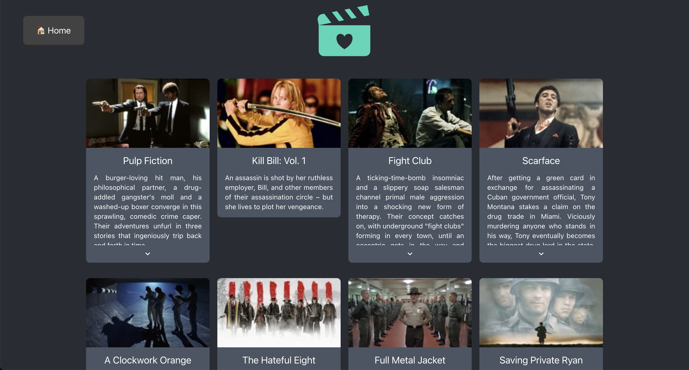

# Movies Suggester

A ReactJS Web App to get Movies and TV Shows recommendations <u> based on your [Trakt](https://trakt.tv/) history </u>.

The recommendations are obtained from [TMDB](https://www.themoviedb.org/) using their [API](https://developers.themoviedb.org/3/getting-started/introduction).

The Web App is fully responsive and looks like this for desktop:

The Movies/TV Series are ordered based on an descending score coming from how often TVDB suggested them when generating recommendations for your watched media (the top ones will be the most suggested ones).

## Installation

Some credentials for [Trakt](https://trakt.tv/oauth/applications/new) and [TMDB](https://www.themoviedb.org/settings/api) have to be generated and a file called `src/credentials.js` should be created (an example of the expected content is present in [credentials_example.js](src/credentials_example.js)).

After that, a simple `npm install` followed by an `npn run` should be enough.

## Limitations

To make things easier and don't have to use a backend or routes, I decided to use the [Devices Authentication](https://trakt.docs.apiary.io/#reference/authentication-devices) for Trakt and save the tokens in the browser's LocalStorage. This is ok for personal use but, obviously, **very bad** for production (in which case a proper backend and the [OAuth Authentication](https://trakt.docs.apiary.io/#reference/authentication-oauth) should be used instead).
